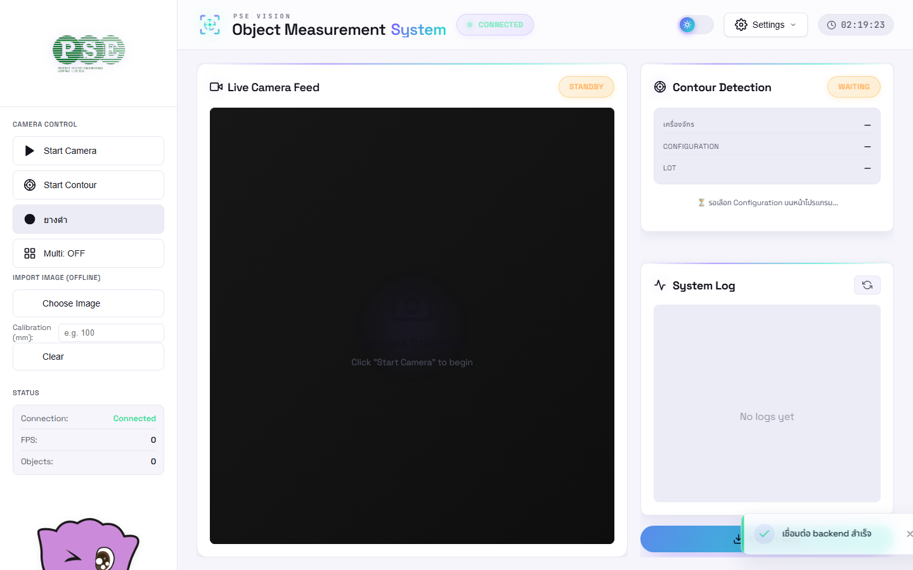
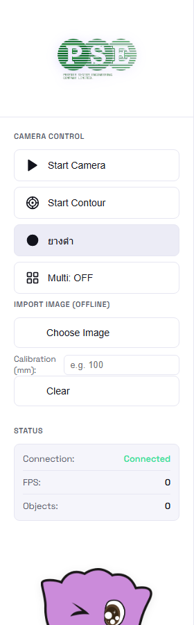
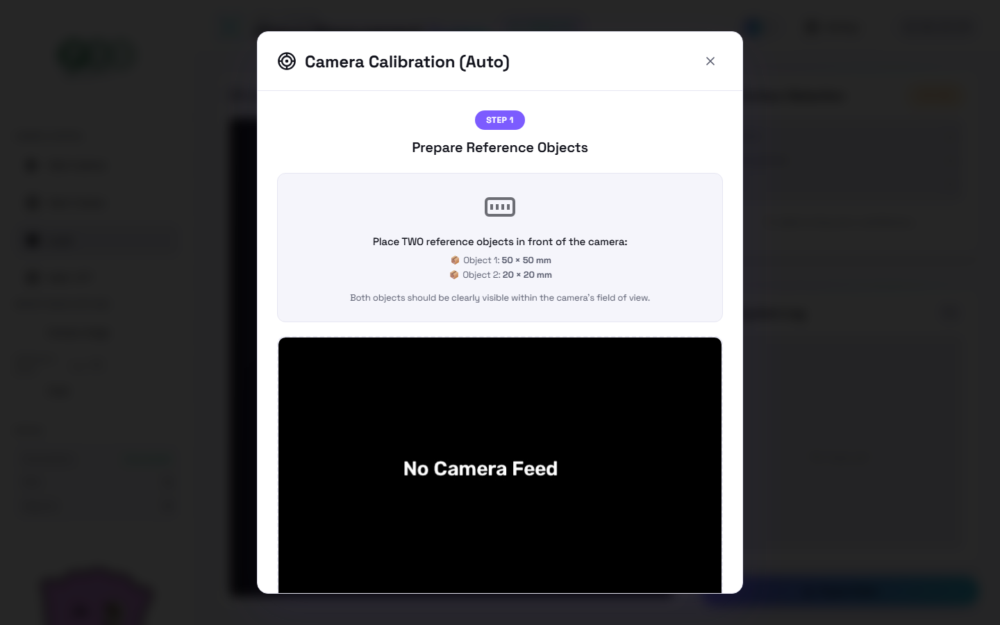
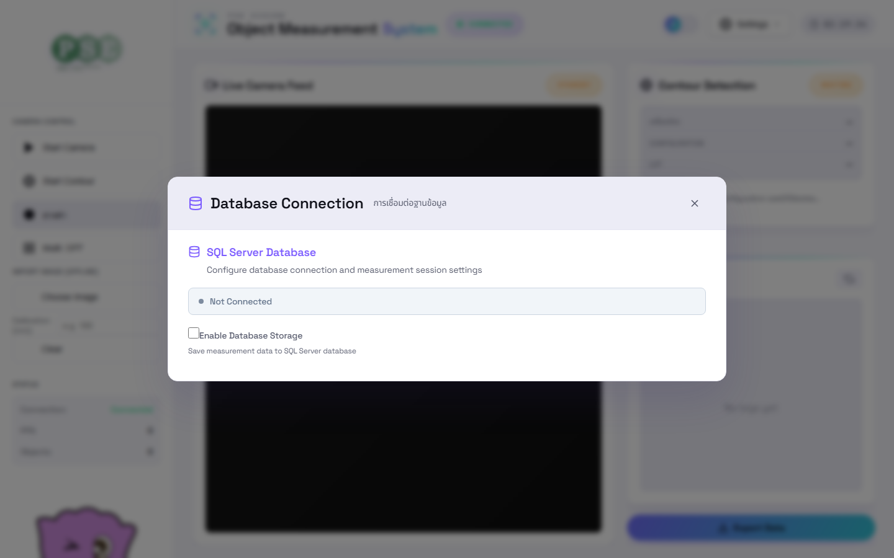
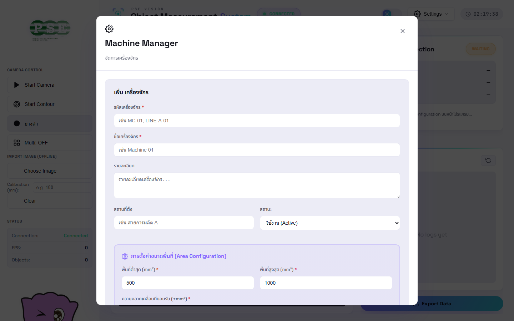
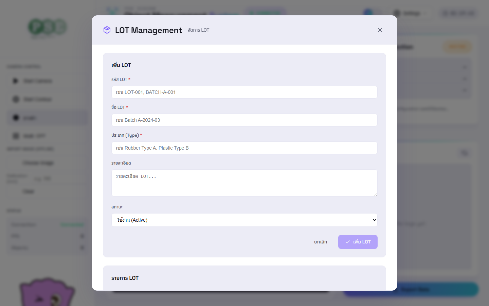
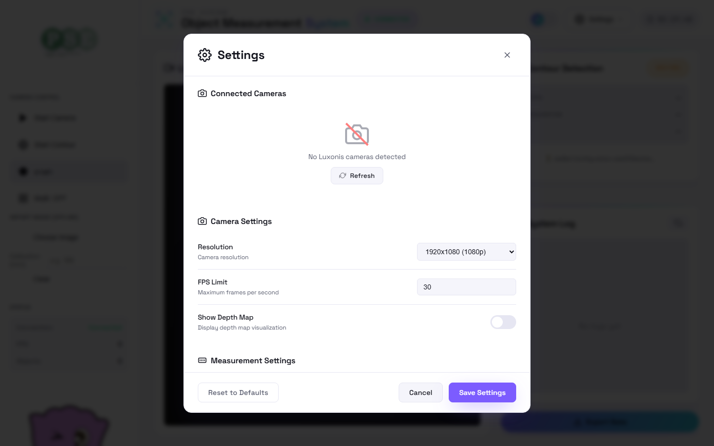
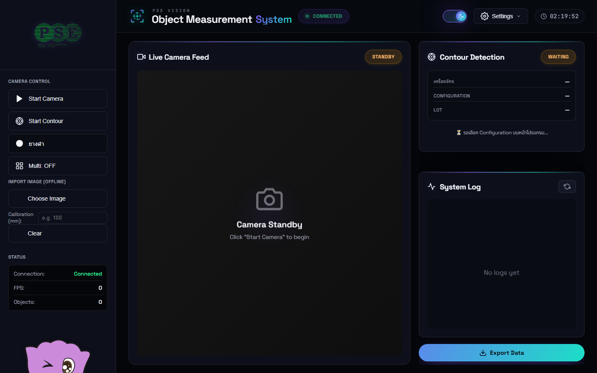

# PSE Vision — คู่มือการใช้งาน (Object Measurement System)

คู่มือนี้อธิบายวิธีใช้งานหน้าเว็บและการตั้งค่าต่างๆ ของระบบวัดขนาดวัตถุ PSE Vision
พร้อมภาพหน้าจอจริงของโปรแกรม

> ✅ **การตั้งค่าทั้งหมดในคู่มือนี้ทำได้จริงในโปรแกรม** — บางส่วนใช้ได้ทันที (offline)
> และบางส่วนต้องเปิดกล้องก่อน (จะระบุไว้ในแต่ละหัวข้อ)

---

## 1. ภาพรวมหน้าจอหลัก

หน้าจอแบ่งเป็น 3 ส่วน:

| ส่วน | รายละเอียด |
|------|-----------|
| **ซ้าย — Sidebar** | ปุ่มควบคุมกล้อง, นำเข้าภาพ, และสถานะระบบ |
| **กลาง — Live Camera Feed** | ภาพสดจากกล้อง + กรอบ ROI ที่ตรวจจับ |
| **ขวา — Contour Detection / System Log** | ผลการตรวจจับ/วัดขนาด, สถิติ, และบันทึกระบบ |

**แถบด้านบน (Header):**
- 🟢 **CONNECTED / 🔴 DISCONNECTED** — สถานะการเชื่อมต่อ backend/กล้อง
- ☀️/🌙 **ปุ่มสลับธีม** — สลับโหมดสว่าง (Light) / มืด (Dark)
- ⚙️ **Settings** — เมนูตั้งค่าทั้งหมด
- 🕐 **นาฬิกา** — เวลาปัจจุบัน

---

## 2. การเปิดกล้องใช้งาน

ที่ **Sidebar → CAMERA CONTROL**:

1. กด **▶ Start Camera** เพื่อเริ่มกล้อง — ปุ่มจะเปลี่ยนเป็น **⏸ Stop Camera** และภาพสดจะขึ้นที่กลางจอ
2. ตรวจสอบที่ **STATUS** ด้านล่าง:
   - **Connection: Connected** = เชื่อมต่อกล้องสำเร็จ
   - **FPS** = อัตราเฟรมภาพต่อวินาที
   - **Objects** = จำนวนวัตถุที่ตรวจจับได้
3. กด **Stop Camera** อีกครั้งเพื่อหยุด

> 💡 ถ้าขึ้น "No OAK camera detected" ให้ตรวจสายกล้อง USB/PoE หรือตั้ง IP กล้องในหน้า Settings

**ทดสอบโดยไม่มีกล้อง (Offline):** ที่ **IMPORT IMAGE (OFFLINE)**
- กด **Choose Image** เลือกไฟล์ภาพเพื่อทดสอบการตรวจจับ
- ใส่ค่า **Calibration (mm)** ถ้าต้องการแปลงเป็นขนาดจริง
- กด **Clear** เพื่อล้างภาพ

---

## 3. การตรวจจับ (Contour Detection)

ที่ **Sidebar → CAMERA CONTROL** (ต้องเปิดกล้องก่อน):

1. กด **◎ Start Contour** เพื่อเริ่มตรวจจับ contour (แยกวัตถุออกจากพื้นหลัง แล้วตีกรอบ ROI)
2. ปุ่ม **ยางดำ / ยางขาว** — สลับชนิดวัสดุให้ตรงกับงาน
   - **ยางดำ** = พื้นขาว–วัตถุดำ
   - **ยางขาว** = พื้นดำ–วัตถุขาว
   - *(กดได้เมื่อเปิดกล้อง + เปิด Contour แล้วเท่านั้น)*
3. ปุ่ม **Multi: OFF/ON** — เปิดตรวจจับ **หลายวัตถุพร้อมกัน**

**ผลลัพธ์แสดงที่แผงขวา (Contour Detection):**
- **เครื่องจักร / Configuration / LOT** — การตั้งค่าที่กำลังใช้งาน
- **Target Area / Tolerance** — เกณฑ์ขนาดที่ยอมรับ
- **สถิติ 3 ระดับ:** Total (ทั้งหมด) · ✓ Pass (ผ่าน) · ▲ Near (ใกล้เคียง) · ✗ Fail (ไม่ผ่าน)

กรอบ ROI บนภาพสดจะแสดงสี: **เขียว = ผ่าน, เหลือง = ใกล้เคียง, แดง = ไม่ผ่าน**

---

## 4. การคาลิเบรตขนาด (Calibration)

เปิดจาก **Settings → Calibration**

ระบบใช้ **การคาลิเบรตอัตโนมัติ (Auto)** ด้วยวัตถุอ้างอิง 2 ชิ้น:

1. **STEP 1 — เตรียมวัตถุอ้างอิง:** วางวัตถุอ้างอิง 2 ชิ้นหน้ากล้อง
   - Object 1: **50 × 50 mm**
   - Object 2: **20 × 20 mm**
   - ให้เห็นทั้งสองชิ้นชัดเจนในเฟรม
2. ทำตามขั้นตอนถัดไปในหน้าต่าง เพื่อให้ระบบคำนวณค่า **mm ต่อ pixel** อัตโนมัติ
3. เมื่อสำเร็จ ระบบจะบันทึกค่าคาลิเบรชัน และวัดขนาดวัตถุเป็น **มิลลิเมตร** ได้ทันที

> 💡 ควรคาลิเบรตใหม่ทุกครั้งที่ขยับกล้อง/เปลี่ยนระยะ เพื่อความแม่นยำ

---

## 5. การตั้งค่าฐานข้อมูล (Database)

เปิดจาก **Settings → Database Connection**

ใช้เก็บผลการวัดลง **SQL Server**:

1. ดูสถานะการเชื่อมต่อ (**Not Connected / Connected**)
2. ติ๊ก **Enable Database Storage** เพื่อเปิดการบันทึกลงฐานข้อมูล
   - เมื่อเปิด จะมีช่องกรอกข้อมูลการเชื่อมต่อ (Host, Username, Password, Database, Table ฯลฯ) และการตั้งค่ารอบการวัด (measurement session)
3. บันทึกการตั้งค่า

> 💡 ถ้าไม่เปิดใช้ ระบบยังทำงานวัดขนาดได้ปกติ เพียงแต่ไม่บันทึกลงฐานข้อมูล

---

## 6. การจัดการเครื่องจักร (Machines) — ตั้งเกณฑ์ Pass/Fail

เปิดจาก **Settings → Machines**

ใช้กำหนด **เกณฑ์ขนาดที่ยอมรับ** ของแต่ละเครื่องจักร (ใช้ตัดสิน Pass/Fail):

1. กรอกข้อมูลเครื่องจักร:
   - **รหัสเครื่องจักร*** (เช่น MC-01)
   - **ชื่อเครื่องจักร*** (เช่น Machine 01)
   - **รายละเอียด / สถานที่ตั้ง / สถานะ** (Active/Inactive)
2. ตั้งค่า **Area Configuration (การตั้งค่าขนาดพื้นที่):**
   - **พื้นที่ต่ำสุด (mm²)** — เช่น 500
   - **พื้นที่สูงสุด (mm²)** — เช่น 1000
   - **ความคลาดเคลื่อนที่ยอมรับ (±mm²)**
3. บันทึก — เครื่องจักรนี้จะปรากฏให้เลือกใช้งาน และเกณฑ์นี้จะถูกใช้ตัดสิน Pass/Near/Fail

---

## 7. การจัดการ LOT

เปิดจาก **Settings → LOT Management**

ใช้จัดกลุ่มการผลิต/ล็อตงาน:

1. กรอก **รหัส LOT*** (เช่น LOT-001), **ชื่อ LOT*** (เช่น Batch A-2024-03)
2. เลือก **ประเภท (Type)*** (เช่น Rubber Type A)
3. ใส่ **รายละเอียด** และ **สถานะ** (Active/Inactive)
4. กด **เพิ่ม LOT** — รายการจะแสดงในส่วน "รายการ LOT" ด้านล่าง

---

## 8. การตั้งค่าทั่วไป (General Settings)

เปิดจาก **Settings → General Settings**

- **Connected Cameras** — แสดงกล้อง Luxonis ที่ต่ออยู่ (กด **Refresh** เพื่อค้นหาใหม่)
- **Camera Settings:**
  - **Resolution** — ความละเอียดกล้อง (เช่น 1920×1080)
  - **FPS Limit** — จำกัดเฟรมต่อวินาที (เช่น 30)
  - **Show Depth Map** — เปิด/ปิดการแสดงแผนที่ความลึก
- **Measurement Settings** — การตั้งค่าการวัด (เลื่อนลงดูเพิ่ม)
- ปุ่มล่าง: **Reset to Defaults** (คืนค่าเริ่มต้น) · **Cancel** · **Save Settings**

---

## 9. โหมดสว่าง / มืด (Light / Dark)

กดปุ่ม ☀️/🌙 บนแถบด้านบนเพื่อสลับธีม — ระบบจะจดจำค่าที่เลือกไว้

---

## 10. ส่งออกข้อมูล (Export Data)

กดปุ่ม **⬇ Export Data** (มุมขวาล่าง) เพื่อบันทึกผลการวัดและบันทึกระบบเป็นไฟล์

---

## สรุปตารางการตั้งค่าทั้งหมด

| เมนู | ทำอะไรได้ | ต้องเปิดกล้อง? |
|------|-----------|:---:|
| Start Camera | เปิด/ปิดกล้อง | — |
| Start Contour + ยางดำ/ขาว + Multi | ตรวจจับ+ตีกรอบ ROI | ✅ |
| Import Image | ทดสอบด้วยภาพไฟล์ | ❌ |
| Calibration | ตั้งค่า mm/pixel (auto 2 วัตถุ) | ✅ |
| Database Connection | เก็บผลลง SQL Server | ❌ |
| Machines | ตั้งเกณฑ์ขนาด Pass/Fail | ❌ |
| LOT Management | จัดการล็อตงาน | ❌ |
| General Settings | ความละเอียด/FPS/Depth ฯลฯ | ❌ |
| Theme / Export | สลับธีม / ส่งออกข้อมูล | ❌ |

---
*เอกสารนี้อ้างอิงหน้าจอจริงของ PSE Vision — ภาพประกอบอยู่ในโฟลเดอร์ `docs/manual_img/`*
